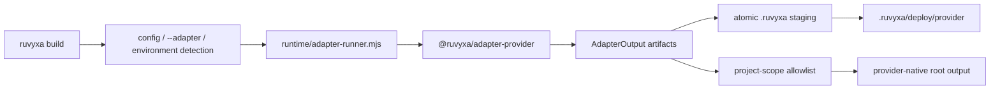

# Deployment Adapter Architecture

## Scope

- Project: Ruvyxa monorepo
- Inspection date: 2026-07-25
- Intake and final scope: zero-config Railway, Render, Firebase Hosting, and AWS hosting
- Pass level: Full Mode
- Pass reason: the change crosses Rust CLI, TypeScript runtime, public package contracts,
  infrastructure output, npm packaging, tests, and user documentation
- Inspected: root manifests, CLI build flow, adapter runner, core adapter types/utilities, all
  existing first-party adapters and tests, release scripts, deployment guides
- Skipped: application rendering internals unrelated to adapter artifact materialization; live
  provider accounts and credentials

## Confirmed Architecture

The deployment path has one control flow and one artifact security boundary:

| Component                                        | Responsibility                                                                                              | Evidence strength |
| ------------------------------------------------ | ----------------------------------------------------------------------------------------------------------- | ----------------- |
| `crates/ruvyxa_cli/src/main.rs`                  | Parse built-in names, select stable host environment signals, invoke the runner after the atomic core build | Direct            |
| `packages/ruvyxa/runtime/adapter-runner.mjs`     | Resolve adapter packages, validate route capabilities, materialize artifacts, constrain project-root writes | Direct            |
| `packages/@ruvyxa/core/src/types.ts`             | Public adapter/artifact contract and platform metadata                                                      | Direct            |
| `packages/@ruvyxa/core/src/standalone-server.ts` | Shared long-lived Node HTTP runtime for Node, Bun, Railway, Render, and Amplify compute                     | Direct            |
| `packages/@ruvyxa/adapter-*`                     | Provider-native artifact declaration and runtime bridge                                                     | Direct            |
| `scripts/pack-smoke.mjs`                         | Prove first-party adapters remain resolvable after npm packing                                              | Direct            |

## Provider Boundaries

| Provider            | Runtime model                             | Native output                                            | Selection                                                  |
| ------------------- | ----------------------------------------- | -------------------------------------------------------- | ---------------------------------------------------------- |
| Railway             | Long-lived Node process                   | standalone server + `railway.json`                       | `RAILWAY_PROJECT_ID`                                       |
| Render              | Long-lived Node process                   | standalone server + `render.yaml` Blueprint              | `RENDER`                                                   |
| Firebase Hosting    | CDN static files + Cloud Functions v2     | publish directory + functions codebase + `firebase.json` | explicit `--adapter firebase` or `RUVYXA_ADAPTER=firebase` |
| AWS Amplify Hosting | static primitive + Node compute primitive | `.amplify-hosting/` deployment specification             | `AWS_APP_ID`                                               |

Firebase has no stable Hosting build-environment signal because deployment is initiated by the
Firebase CLI. Account authentication and project selection are external prerequisites, not framework
configuration.

AWS support intentionally targets AWS Amplify Hosting. “AWS” does not imply automatic provisioning
of unrelated AWS services such as ECS, RDS, API Gateway, or arbitrary IAM resources.

## Decisions

1. Add one first-party package per provider.
   - Rejected: alias every provider to `adapter-node`.
   - Reason: Firebase and Amplify require native manifests and runtime signatures.
   - Reversal cost: low; packages remain isolated behind the existing adapter contract.
2. Reuse the shared standalone server for long-lived Node hosts and Amplify compute.
   - Rejected: copy the full HTTP runtime into each package.
   - Reason: request ordering, static fallback, cookies, cache headers, and ISR behavior must not
     drift across hosts.
3. Add an additive `isrCache: "tmp"` standalone option for immutable compute bundles.
   - Reason: Amplify compute can write only under `/tmp`; Node/Railway/Render retain the existing
     bundle-local default.
4. Preserve user-authored provider configuration with `skipIfExists`.
   - Reason: generated defaults must never replace deliberate infrastructure configuration.

## Findings and Corrections

### Built-in registry duplication

- Evidence: provider names appear in the Rust CLI, JS runner, `ruvyxa` dependencies, pack smoke,
  type unions, tests, and docs.
- Impact: omitting any registry can make development pass while packed installs fail.
- Severity: Medium
- Confidence: Direct
- Correction: every provider addition updates and tests the complete registry/package path.

### Project-root artifact boundary

- Evidence: the runner rejects every project-scope path outside an explicit allowlist.
- Impact: broadening the allowlist to arbitrary paths would let adapter code overwrite project
  source or configuration.
- Severity: High
- Confidence: Direct
- Correction: allow only the exact provider discovery paths and retain traversal/containment tests.

## Risks and Operational Limits

- Firebase dynamic deployment requires a Blaze-enabled project because Cloud Functions backs SSR and
  API routes. Firebase Hosting requests to a function have a provider timeout.
- Firebase runtime dependencies are installed from the generated function `package.json` during
  deployment; provider CLI validation remains an operational proof beyond local unit tests.
- Amplify compute has ephemeral, instance-local `/tmp` storage. ISR refreshes work per warm instance
  but are not a durable cross-instance cache.
- Native WebSocket realtime is supported on Railway and Render, not Firebase Functions or Amplify
  compute.
- Project/account creation, credentials, billing, secrets, domains, and production rollout are
  explicitly outside this adapter boundary.

## Validation Gate

1. Claim traceability: all implementation claims map to the paths above; provider constraints are
   based on provider-native output contracts.
2. Scope alignment: final scope matches the requested four providers; AWS is explicitly bounded to
   Amplify Hosting.
3. Handoff readiness: provider selection, outputs, limitations, verification, and unsafe scope
   expansions are recorded here.
4. Open architecture questions: none identified for the implemented boundary.
