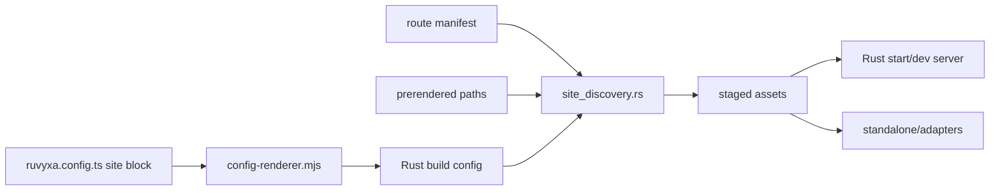

# Crawler Discovery Architecture

Ruvyxa owns a zero-config production path for `/sitemap.xml` and `/robots.txt`, while preserving
explicit static files and programmatic routes. The public contract is defined by `SiteConfig` in
`@ruvyxa/core`; the config renderer validates and serializes it for the Rust CLI.

## Build and Serving Flow

Generation happens after prerendering, when concrete dynamic SSG paths are known, and before plugin
completion and adapter packaging. Adapters therefore snapshot the final staged assets.

## Ownership and Precedence

For each discovery path independently:

1. A staged project file from `public/` suppresses the core generator.
2. An exact application route such as `app/sitemap.xml/route.ts` suppresses the core generator and
   owns programmatic responses in every runtime.
3. Otherwise the core generator writes the default or configured file.
4. An explicitly configured plugin runs later and may intentionally replace an asset it owns.

This avoids dev/production drift: an exact metadata route is not shadowed by a generated static file
after build. Unrelated dynamic routes never capture missing `/sitemap.xml` or `/robots.txt`.

## Sitemap Contract

- The canonical origin resolves in order from `site.url`, `RUVYXA_SITE_URL`,
  `VERCEL_PROJECT_PRODUCTION_URL`, production-only `VERCEL_URL`, then Netlify `URL` when
  `NETLIFY=true`.
- Origins accept HTTP(S) only and reject credentials, non-root paths, queries, fragments, invalid
  hosts, and invalid ports. Bare hosts normalize to HTTPS.
- Static page routes, concrete prerendered paths, and `additionalPaths` are sorted and deduplicated.
  APIs and unresolved route patterns are excluded.
- Paths are percent-encoded, XML text is escaped, and every `<loc>` is absolute.
- Each sitemap stays within 50,000 URLs and 50 MB. Larger sets produce `sitemap.xml` as an index
  that references `sitemap-0.xml`, `sitemap-1.xml`, and so on.
- Route metadata such as `meta.noindex` is render-time state and is not evaluated by the build
  graph. Use `site.sitemap.exclude` or an explicit route when it must control sitemap membership.

## Robots Contract

The default is `User-agent: *` with `Allow: /`. Structured rules support one or more crawler tokens,
`allow`, `disallow`, `crawlDelay`, multiple sitemap records, and a host record. Values are validated
before serialization so newlines or malformed paths cannot inject additional records. When the core
sitemap exists, or an exact sitemap route owns the path, its absolute URL is linked automatically
unless `site.robots.sitemap` overrides it.

Generated files are UTF-8. Rust and standalone servers return `text/plain; charset=utf-8` for `.txt`
and `application/xml; charset=utf-8` for `.xml`. Public assets revalidate hourly; only
content-addressed client bundles are immutable.

## Compatibility Boundary

The boolean `site.sitemap` and `site.robots` settings remain supported. Ruvyxa provides functional
production parity with static and programmatic metadata ownership, but does not copy Next.js's
source file names: programmatic output is an ordinary exact Ruvyxa route. Rich sitemap extensions
such as image, video, news, alternate-language, priority, and per-entry modification time remain the
responsibility of that route or an explicit plugin.
