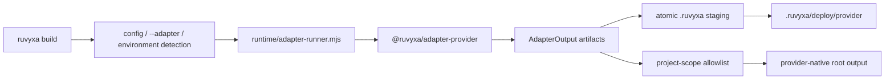

# สถาปัตยกรรม Deployment Adapter

## ขอบเขต

- โครงการ: Ruvyxa monorepo
- วันที่ตรวจสอบ: 2026-07-25
- ขอบเขตตั้งต้นและผลลัพธ์: Railway, Render, Firebase Hosting และ AWS Hosting
  ที่ตั้งค่าได้โดยอัตโนมัติ
- ระดับการตรวจสอบ: Full Mode
- เหตุผล: การเปลี่ยนแปลงครอบคลุม Rust CLI, TypeScript runtime, สัญญาแพ็กเกจสาธารณะ,
  ไฟล์โครงสร้างพื้นฐาน, npm packaging, การทดสอบ และเอกสารผู้ใช้
- สิ่งที่ตรวจสอบ: manifest ระดับราก, ขั้นตอน build ของ CLI, adapter runner, ชนิดและ utility ของ core
  adapter, first-party adapter และการทดสอบทั้งหมด, สคริปต์ release และคู่มือ deployment
- สิ่งที่ไม่ครอบคลุม: รายละเอียดการเรนเดอร์แอปที่ไม่เกี่ยวกับการสร้าง artifact ของ adapter
  รวมถึงบัญชีและข้อมูลรับรองของผู้ให้บริการจริง

## สถาปัตยกรรมที่ยืนยันแล้ว

เส้นทาง deployment มี flow ควบคุมหนึ่งเส้นและขอบเขตความปลอดภัยสำหรับ artifact หนึ่งชั้น:



| ส่วนประกอบ                                       | หน้าที่รับผิดชอบ                                                                                            | ระดับหลักฐาน |
| ------------------------------------------------ | ----------------------------------------------------------------------------------------------------------- | ------------ |
| `crates/ruvyxa_cli/src/main.rs`                  | แยกชื่อ adapter ในตัว, เลือกสัญญาณ environment ของโฮสต์ที่เสถียร และเรียก runner หลัง core build แบบ atomic | Direct       |
| `packages/ruvyxa/runtime/adapter-runner.mjs`     | ค้นหาแพ็กเกจ adapter, ตรวจสอบความสามารถของ route, สร้าง artifact และจำกัดการเขียนภายใน project root         | Direct       |
| `packages/@ruvyxa/core/src/types.ts`             | สัญญา adapter/artifact สาธารณะและ metadata ของแพลตฟอร์ม                                                     | Direct       |
| `packages/@ruvyxa/core/src/standalone-server.ts` | Node HTTP runtime แบบทำงานต่อเนื่องที่ใช้ร่วมกันสำหรับ Node, Bun, Railway, Render และ Amplify compute       | Direct       |
| `packages/@ruvyxa/adapter-*`                     | ประกาศ artifact ที่ผู้ให้บริการต้องใช้และ runtime bridge                                                    | Direct       |
| `scripts/pack-smoke.mjs`                         | ยืนยันว่า first-party adapter ยังค้นพบได้หลัง pack เป็น npm package                                         | Direct       |

## การตรวจสอบความสามารถแบบอ่านอย่างเดียว

`adapter-runner.mjs` แยกโหมด `build` และ `inspect` ออกจากกัน โหมด inspect
จะประเมินผลลัพธ์เชิงประกาศของ adapter เพื่อรายงาน `name`, `target`, `runtime`, `platform` และ
`supports` แต่จะไม่ตรวจสอบ route artifact หรือสร้างไฟล์จริง CLI ใช้โปรโตคอลนี้จาก `doctor`
เพื่อเปรียบเทียบทุก route ใน manifest กับ capability ของ adapter ก่อน deployment:

```text
doctor --adapter static --json
  -> adapter.supports = [ssg, csr]
  -> unsupportedRoutes = [{ path: /api/health, requires: api }]
```

Adapter ที่ไม่ได้ระบุ `supports` จะยังคงค่าเริ่มต้นเดิมซึ่งรองรับความสามารถครบถ้วน
โปรโตคอลนี้เป็นการเพิ่มความสามารถเท่านั้น: การ build ปกติยังตรวจ capability ก่อนสร้าง artifact เสมอ

## ขอบเขตของผู้ให้บริการ

| ผู้ให้บริการ        | รูปแบบ runtime                          | ผลลัพธ์ native                                           | การเลือกใช้                                              |
| ------------------- | --------------------------------------- | -------------------------------------------------------- | -------------------------------------------------------- |
| Railway             | Node process ที่ทำงานต่อเนื่อง          | standalone server + `railway.json`                       | `RAILWAY_PROJECT_ID`                                     |
| Render              | Node process ที่ทำงานต่อเนื่อง          | standalone server + Render Blueprint `render.yaml`       | `RENDER`                                                 |
| Firebase Hosting    | ไฟล์ static บน CDN + Cloud Functions v2 | publish directory + functions codebase + `firebase.json` | ระบุ `--adapter firebase` หรือ `RUVYXA_ADAPTER=firebase` |
| AWS Amplify Hosting | primitive สำหรับ static + Node compute  | deployment specification ใน `.amplify-hosting/`          | `AWS_APP_ID`                                             |

Firebase ไม่มีสัญญาณ build environment ของ Hosting ที่เสถียร เพราะ Firebase CLI เป็นผู้เริ่ม
deployment การยืนยันตัวตนและการเลือกโปรเจกต์เป็นเงื่อนไขภายนอก ไม่ใช่การตั้งค่าของ framework

การรองรับ AWS ตั้งใจจำกัดไว้ที่ AWS Amplify Hosting คำว่า “AWS” ไม่ได้หมายความว่าจะ provision บริการ
AWS อื่น เช่น ECS, RDS, API Gateway หรือ IAM แบบอัตโนมัติ

## การตัดสินใจ

1. เพิ่ม first-party package แยกหนึ่งตัวต่อผู้ให้บริการ
   - ไม่เลือก: ทำทุก provider ให้เป็น alias ของ `adapter-node`
   - เหตุผล: Firebase และ Amplify ต้องใช้ manifest native และ runtime signature ของตนเอง
   - ต้นทุนในการย้อนกลับ: ต่ำ เพราะแต่ละ package ถูกแยกไว้หลังสัญญา adapter เดิม
2. ใช้ standalone server ร่วมกันสำหรับโฮสต์ Node ที่ทำงานต่อเนื่องและ Amplify compute
   - ไม่เลือก: คัดลอก HTTP runtime ทั้งชุดเข้าแต่ละ package
   - เหตุผล: ลำดับการประมวลผล request, static fallback, cookie, cache header และ ISR
     ต้องไม่แยกพฤติกรรมระหว่างโฮสต์
3. เพิ่มตัวเลือก standalone `isrCache: "tmp"` แบบ additive สำหรับ immutable compute bundle
   - เหตุผล: Amplify compute เขียนได้เฉพาะใต้ `/tmp`; Node/Railway/Render ยังใช้ค่าเริ่มต้นแบบ
     bundle-local เดิม
4. เก็บการตั้งค่าของผู้ให้บริการที่ผู้ใช้เขียนเองด้วย `skipIfExists`
   - เหตุผล: ค่าเริ่มต้นที่สร้างโดยระบบต้องไม่เขียนทับ configuration
     โครงสร้างพื้นฐานที่ผู้ใช้ตั้งใจสร้างไว้

## ข้อค้นพบและการแก้ไข

### Registry ของ built-in ซ้ำกันหลายจุด

- หลักฐาน: ชื่อ provider ปรากฏใน Rust CLI, JS runner, dependency ของ `ruvyxa`, pack smoke, type
  union, การทดสอบ และเอกสาร
- ผลกระทบ: หากพลาดการอัปเดต registry ใดจุดหนึ่ง การพัฒนาใน workspace อาจผ่าน
  แต่การติดตั้งจากแพ็กเกจที่ pack แล้วอาจล้มเหลว
- ระดับความรุนแรง: Medium
- ความเชื่อมั่น: Direct
- แนวทางแก้: ทุกครั้งที่เพิ่ม provider ต้องอัปเดตและทดสอบเส้นทาง registry/package ให้ครบทั้งชุด

### ขอบเขต artifact ใน project root

- หลักฐาน: runner ปฏิเสธทุก project-scope path ที่อยู่นอก allowlist แบบระบุชัดเจน
- ผลกระทบ: หากขยาย allowlist ให้เขียน path ใดก็ได้ โค้ด adapter อาจเขียนทับ source หรือ
  configuration ของโปรเจกต์
- ระดับความรุนแรง: High
- ความเชื่อมั่น: Direct
- แนวทางแก้: อนุญาตเฉพาะ path ที่ provider ใช้ค้นหาไฟล์จริง และคงการทดสอบ traversal/containment ไว้

## ความเสี่ยงและข้อจำกัดในการใช้งาน

- การ deploy แบบ dynamic บน Firebase ต้องใช้โปรเจกต์ที่เปิด Blaze plan เพราะ SSR และ API route
  ทำงานผ่าน Cloud Functions และ request ที่ส่งไป function มี timeout ของผู้ให้บริการ
- dependency ของ Firebase runtime จะติดตั้งจาก `package.json` ของ function ที่สร้างขึ้นระหว่าง
  deploy; การตรวจด้วย provider CLI ยังเป็นหลักฐานเชิงปฏิบัติการที่ต้องทำเพิ่มจาก unit test ในเครื่อง
- Amplify compute มีพื้นที่ `/tmp` ชั่วคราวและแยกตาม instance การ refresh ของ ISR ทำงานได้ใน warm
  instance แต่ไม่ใช่ cache ถาวรที่แชร์ข้าม instance
- WebSocket แบบ native รองรับบน Railway และ Render แต่ไม่รองรับบน Firebase Functions หรือ Amplify
  compute
- การสร้างโปรเจกต์/บัญชี, credentials, billing, secret, domain และการ rollout production
  อยู่นอกขอบเขตของ adapter นี้โดยชัดเจน

## เกณฑ์การยืนยัน

1. การตรวจสอบย้อนกลับของข้ออ้าง: ข้ออ้างเกี่ยวกับ implementation ทุกข้อเชื่อมกับ path ด้านบน
   ข้อจำกัดของ provider อิงจากสัญญา native output ของผู้ให้บริการ
2. ความสอดคล้องของขอบเขต: ผลลัพธ์ตรงกับผู้ให้บริการสี่รายที่ร้องขอ และ AWS ถูกจำกัดความหมายไว้ที่
   Amplify Hosting อย่างชัดเจน
3. ความพร้อมส่งต่องาน: การเลือก provider, output, ข้อจำกัด, การตรวจสอบ
   และการขยายขอบเขตที่ไม่ปลอดภัยถูกบันทึกไว้แล้ว
4. คำถามด้านสถาปัตยกรรมที่ยังเปิดอยู่: ไม่พบภายในขอบเขตที่นำไปใช้
