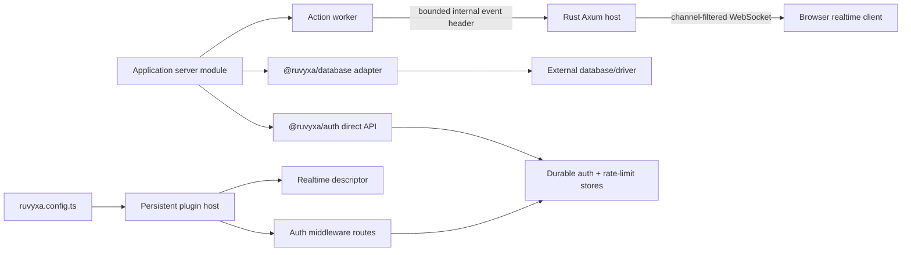

# แพ็กเกจ Official Data, Auth และ Realtime

Ruvyxa มาพร้อมกับแพ็กเกจ first-party สามตัวที่มุ่งเน้นสำหรับการจัดการสถานะของแอปพลิเคชัน พวกมันใช้
สัญญาสาธารณะของเฟรมเวิร์ก แต่ไม่ได้ถือว่าสถานะของโมดูล JavaScript ถูกแชร์ข้ามกระบวนการของ Ruvyxa



## ความเป็นเจ้าของในแต่ละกระบวนการ

- Config/build plugins และ request middleware ทำงานใน plugin hosts Node/Bun
  แบบถาวรหนึ่งตัวหรือมากกว่า
- Pages, API handlers และ server actions ทำงานใน render workers ที่แยกกัน
- Rust host เป็นเจ้าของ HTTP limits, same-origin WebSocket handshakes, broadcast capacity, heartbeat
  และการล้างการเชื่อมต่อ
- Serverless functions มี lifecycle อิสระและไม่รัน Rust WebSocket host

ดังนั้น database pools จึงเป็นของ driver ที่เลือกในแต่ละ server process, auth sessions เป็นของ
external store ที่ทนทาน, และ realtime action events ข้าม protocol ของ worker ที่มีอยู่
ไม่มีแพ็กเกจใดที่พึ่งพา singleton ระดับกระบวนการที่แชร์ระหว่างขอบเขตเหล่านี้

## `@ruvyxa/database`

`createDatabase<Schema>(adapter)` เปิดเผย typed model delegates สำหรับ `findMany`, `findFirst`,
`findUnique`, `create`, `createMany`, `update`, `updateMany`, `delete`, `deleteMany` และ `count`
รวมถึงเมธอด lifecycle สำหรับการเชื่อมต่อและ transaction มันตรวจสอบ pagination, single-record
selectors, write payloads, model names และความสามารถของ transaction ก่อนที่จะมอบหมายงานให้ดำเนินการ

| ระบบหลัง   | การผสานรวม                                           | ความเป็นเจ้าของ                                                 |
| ---------- | ---------------------------------------------------- | --------------------------------------------------------------- |
| PostgreSQL | `prismaAdapter()` หรือ `DatabaseAdapter` ที่กำหนดเอง | Driver/ORM เป็นเจ้าของ pooling และ migrations                   |
| MySQL      | `prismaAdapter()` หรือ `DatabaseAdapter` ที่กำหนดเอง | Driver/ORM เป็นเจ้าของ pooling และ migrations                   |
| SQLite     | `prismaAdapter()` หรือ `DatabaseAdapter` ที่กำหนดเอง | Driver เป็นเจ้าของ file locking และ migrations                  |
| MongoDB    | `prismaAdapter()` หรือ `DatabaseAdapter` ที่กำหนดเอง | Driver/ORM เป็นเจ้าของ connections และ schema policy            |
| DynamoDB   | `dynamoAdapter({ transport, tables })`               | Transport เป็นเจ้าของ AWS SDK commands, retries และ credentials |

Dynamo transport รับ operation ที่ทำให้เป็นมาตรฐานพร้อมชื่อ table ที่ชัดเจน ทำให้
เฟรมเวิร์กเป็นอิสระจาก AWS SDK major versions ในขณะที่ยังคง API เดียวที่面向แอปพลิเคชัน operations
ที่ไม่สนับสนุนต้องล้มเหลวอย่างชัดเจนใน transport; ต้องไม่เงียบๆ scan หรือ ลดทอน transaction
semantics

`databasePlugin({ requiredEnv })` ตรวจสอบ database config ส่วนตัวตอน production build และ
ปฏิเสธตัวแปร `RUVYXA_PUBLIC_*` สำหรับ database โมดูล database ของแอปพลิเคชันเป็น server-only
เท่านั้น Rust graph validator, native bundler และ Node compiler ปฏิเสธ root imports จาก
`@ruvyxa/database` ใน client graph ด้วย `RUV1007`

## `@ruvyxa/auth`

`createAuth(options)` คืนค่า:

- `plugin` สำหรับ middleware path ที่โฮสต์เองด้วย Node/Bun;
- `handle(request)` สำหรับ API route หรือ serverless/edge request lifecycle;
- `login`, `getSession` และ `logout` สำหรับ server-only application code

endpoint ฐานเริ่มต้นคือ `/__ruvyxa/auth`:

| Endpoint                    | Method | จุดประสงค์                                       |
| --------------------------- | ------ | ------------------------------------------------ |
| `/session`                  | GET    | ถอดรหัส session cookie แบบ opaque                |
| `/login/:provider`          | POST   | การเข้าสู่ระบบด้วย provider แบบ credentials      |
| `/logout`                   | POST   | ลบสถานะบนเซิร์ฟเวอร์และทำให้ cookie หมดอายุ      |
| `/oauth/:provider/start`    | GET    | สร้าง PKCE verifier/state และเปลี่ยนเส้นทาง      |
| `/oauth/:provider/callback` | GET    | ใช้ state แบบอะตอมมิก, แลก code, ถอดรหัส profile |
| `/magic-link`               | POST   | สร้างและส่ง token แบบใช้ครั้งเดียวทางอีเมล       |
| `/magic-link/callback`      | GET    | แสดงหน้า confirmation โดยไม่ใช้ token            |
| `/magic-link/callback`      | POST   | ใช้ email token แบบอะตอมมิกและสร้าง session      |
| `/webauthn/options`         | POST   | มอบหมายการสร้าง challenge/options                |
| `/webauthn/verify`          | POST   | มอบหมายการตรวจสอบตามมาตรฐานและสร้าง session      |

หลักการรักษาความปลอดภัย:

- endpoints ที่ไม่ปลอดภัยต้องการ `Origin` ที่กำหนดค่าไว้
- body ถูก streamed ในขอบเขต 32 KiB และ JSON ที่ไม่ถูกต้องจะ fail แบบ closed;
- session และ one-time token indexes ถูกสร้างจาก HMAC-SHA-256 ด้วย secret ที่มี 32+ ตัวอักษร;
- cookies เป็น opaque, HttpOnly, SameSite, ผูกกับ path, และ Secure บน HTTPS;
- OAuth ใช้ PKCE S256, state ผูกกับ HttpOnly initiating-browser cookie, durable state
  แบบใช้ครั้งเดียว, protected protocol parameters, HTTPS provider endpoints, bounded provider calls
  และ safe local return paths;
- magic links และ OAuth state ต้องการ `AuthStore.take()` แบบอะตอมมิกเพื่อป้องกัน replay;
- magic-link GET แสดงหน้า confirmation ที่ไม่ใช้ token ดังนั้น mail scanners ที่ prefetch links
  ไม่สามารถเบิร์น tokens; การใช้ token เกิดขึ้นบน POST ต้นทางเดียวกันที่หน้าส่ง;
- rate-limit buckets ผูกกับ resolved client IP เมื่อตั้งค่า `clientIp` (เช่น `forwardedClientIp`
  หลัง trusted proxy) และ fallback ไปยัง user-agent;
- rate limiting ต้องการ `AuthRateLimitStore.consume()` แบบอะตอมมิกและไม่เชื่อถือ forwarded IP
  headers เว้นแต่ deployment เลือกใช้ผ่าน `clientIp`;
- provider tokens ไม่เคยเข้าไปใน browser session payload;
- process-local memory stores ต้องการ `{ development: true }` และจะล้มเหลวใน production plugin
  builds

Google และ GitHub helpers จัดเตรียม endpoints/profile mappings การตรวจสอบ credentials, การส่งอีเมล,
การตรวจสอบ WebAuthn, การคงอยู่ของผู้ใช้, พื้นที่เก็บ Redis/SQL และ password hashing ยังคงเป็น
application adapters ที่ชัดเจน เนื่องจากนโยบายและความเป็นเจ้าของ credentials
ไม่สามารถอนุมานได้อย่างปลอดภัยโดยเฟรมเวิร์ก

entry หลัก `@ruvyxa/auth` เป็น server-only และถูกปฏิเสธจาก client graphs ด้วย `RUV1007`
โค้ดในเบราว์เซอร์ import `createAuthClient` และ public session types จาก `@ruvyxa/auth/client`

## `@ruvyxa/realtime`

`realtime()` ลงทะเบียน native transport หนึ่งตัวผ่าน `native.claim('realtime@1')` descriptor จะถูก
ตรวจสอบทั้งฝั่ง TypeScript และ Rust server action เลือกใช้ด้วย:

```ts
export const updateTodo = action.realtime('todos').handler(async ({ input }) => {
  return db.todos.update(input)
})
```

หลังจาก action สำเร็จ worker จะส่ง internal header แบบ bounded และ base64url Rust จะตรวจสอบ และลบ
header นั้น จากนั้น broadcast เฉพาะ metadata นี้:

```json
{
  "version": 1,
  "type": "action",
  "channels": ["todos"],
  "action": "updateTodo",
  "path": "/todos",
  "invalidated": ["todos"]
}
```

ผลลัพธ์ของ action, database rows, credentials และข้อมูล request ส่วนตัวจะไม่ถูก broadcast การเรียก
`.realtime()` โดยไม่มี channel จะเลือก `route:<request pathname>` client ในเบราว์เซอร์ จะ reconnect
ด้วย bounded exponential backoff และขอเฉพาะ channels ที่ active จาก Rust broadcast receiver
ที่ล่าช้าจะได้รับ event `resync` และควร refetch ข้อมูลที่เชื่อถือได้

route channels ที่ยาวกว่า 128 ตัวอักษรใช้ deterministic mapping `route-hash:<id>` เดียวกันทั้ง ใน
action worker และ browser client event paths ถูกจำกัดที่ 2,048 ตัวอักษร และมี cache invalidation
keys สูงสุด 64 keys ที่ 256 ตัวอักษร ทำให้ internal envelope อยู่ภายใต้ hard transport limit
โดยไม่เปิดเผยผลลัพธ์ของ action

| Deployment                                | Native realtime | เหตุผล                                                     |
| ----------------------------------------- | --------------- | ---------------------------------------------------------- |
| `ruvyxa dev`                              | ใช่             | Rust เป็นเจ้าของ process Axum/WebSocket ที่ทำงานยาวนาน     |
| Self-hosted Node adapter / `ruvyxa start` | ใช่             | Rust host ที่ทำงานยาวนานเหมือนกัน                          |
| Self-hosted Bun adapter / `ruvyxa start`  | ใช่             | host เดียวกัน; Bun รัน JS workers                          |
| Static                                    | ไม่ (`RUV3201`) | ไม่มี request หรือ socket runtime                          |
| Vercel / Netlify serverless               | ไม่ (`RUV3201`) | ไม่มี persistent socket owner ที่พกพาได้                   |
| Cloudflare/Edge                           | ไม่ (`RUV3201`) | adapter contract ปัจจุบันไม่มี Durable Object/broker owner |

Rust instance หนึ่งตัวให้การส่งแบบ bounded ที่ปลอดภัยสำหรับ production สำหรับ instance นั้น
การกระจายแนวนอนข้ามหลาย instances ต้องการ external broker contract; โดยตั้งใจจะไม่ถูกอ้างสิทธิ์
ในรุ่นนี้

## ลักษณะความล้มเหลวและพฤติกรรมการเผยแพร่

- ข้อผิดพลาดของ config ล้มเหลวระหว่าง config/plugin startup
- ข้อมูลลับ database ที่หายไป, auth stores ที่ไม่ทนทานสำหรับ production และ realtime targets
  ที่ไม่สนับสนุนจะล้มเหลวระหว่าง production build
- ข้อผิดพลาดของ adapter/driver จะแพร่กระจายพร้อมสาเหตุ Auth ส่ง failure เต็มรูปแบบไปยัง optional
  `onError` observability hook ในขณะที่ public 500 responses ซ่อนรายละเอียดภายใน
- ทั้งสามแพ็กเกจเป็น additive การลบออกจาก config/application imports จะคืนค่า runtime path ก่อนหน้า;
  ไม่มี schema migration หรือ artifact ที่ถูกสร้างขึ้นเป็นของเฟรมเวิร์ก
