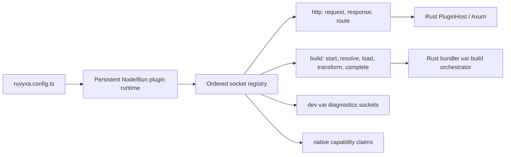

# สถาปัตยกรรมปลั๊กอิน

ปลั๊กอิน Ruvyxa คือแพ็กเกจ TypeScript/JavaScript ที่ทำงานด้วยสิทธิ์ของ server/build โดย export
ค่าเดียวจาก `definePlugin({ name, register })` แล้วลงทะเบียนใน `ruvyxa.config.ts`.

```ts
import { definePlugin } from 'ruvyxa/plugin'

export default definePlugin({
  name: 'request-logger',
  register({ http, build, dev, diagnostics, native }) {
    http.onRequest({
      match: ['/api/*'],
      handler({ request }) {
        if (!request.headers.has('x-request-id'))
          return new Response('Missing request ID', { status: 400 })
      },
    })

    http.onResponse({
      match: ['/api/*'],
      handler({ response }) {
        const headers = new Headers(response.headers)
        headers.set('x-plugin', 'request-logger')
        return new Response(response.body, { status: response.status, headers })
      },
    })

    build.onTransform(({ code, id, environment }) =>
      environment === 'client' && id.endsWith('.tsx') ? code : undefined,
    )
    dev.onFileChange({ match: ['content/*'], handler: ({ paths }) => console.log(paths) })
    diagnostics.report({ level: 'info', code: 'PLG001', message: 'Plugin registered' })
    // `native.claim('realtime@1')` เป็น capability ที่ framework เป็นเจ้าของ
  },
})
```

## ขอบเขตความรับผิดชอบ



Node/Bun รับผิดชอบการโหลดโมดูลและเรียก callback ของปลั๊กอิน ส่วน Rust รับผิดชอบ lifecycle ของ
worker, ลำดับ hook, การตรวจ NDJSON, ขนาด request/response และการเชื่อมกับ Axum/Oxc registry
ถูกสร้างหนึ่งครั้งต่อ runtime process ดังนั้น module state ใช้ร่วมได้เฉพาะใน process เดียว และ
middleware workers ไม่แชร์ state กัน

## Contract ของ socket

| Socket            | การลงทะเบียน                                                  | Contract                                                                          |
| ----------------- | ------------------------------------------------------------- | --------------------------------------------------------------------------------- |
| `http.onRequest`  | handler หรือ `{ match, handler }`                             | คืนค่าว่างเพื่อทำต่อ, `Request` เพื่อแทน request, หรือ `Response` เพื่อหยุด chain |
| `http.onResponse` | handler หรือ `{ match, handler }`                             | คืนค่าว่างหรือ `Response` ใหม่ โดย context มี request ต้นทาง                      |
| `http.route`      | `{ path, method?, handler }`                                  | เป็นเจ้าของ exact application path; method/path ซ้ำไม่ได้                         |
| `build`           | `onStart`, `onResolve`, `onLoad`, `onTransform`, `onComplete` | resolve คืน absolute path; load/transform คืน source หรือ `{ code, map }` ได้     |
| `dev`             | `onFileChange`                                                | ได้ project-relative path ที่ใช้ตัวคั่น `/`                                       |
| `diagnostics`     | `report`                                                      | รายงาน `info`, `warning` หรือ `error` ที่หยุด startup                             |
| `native`          | `claim('realtime@1')`                                         | claim capability แบบ versioned ที่ framework กำหนด และมีเจ้าของได้หนึ่งราย        |

รูปแบบ `match` อาจละไว้, ใช้ `*`, exact path หรือ wildcard ท้ายทางเดียว เช่น `/api/*` การ match ใช้
decoded pathname โดยไม่รวม query string; empty array และ pattern ที่ผิดจะ fail ระหว่าง registration

## ความปลอดภัยและ lifecycle

- ปลั๊กอินไม่ใช่ sandbox: อย่าให้ secret หรือ private environment รั่วสู่ client module
- ลำดับการลงทะเบียนคือลำดับทำงาน การกำหนด route ช่วยให้ Rust ข้าม runtime ได้เมื่อไม่มี hook ที่
  match
- Hook ถูกจำกัดด้วย middleware timeout; protocol ที่ผิดหรือ worker timeout จะถูกแทนที่ และ hook ที่
  timeout จะไม่ retry เพราะอาจเกิด side effect แล้ว
- Header response ที่ซ้ำได้ เช่น `Set-Cookie` ยังคงอยู่ตลอด JavaScript/Rust boundary
- ใช้ module memory เป็น cache ต่อ process เท่านั้น; durable state หรือการประสานงานหลาย worker
  ต้องใช้ shared store ที่ชัดเจน

ดู [คู่มือ Plugins](../../guides/th/14-plugins.md) สำหรับการสร้าง ทดสอบ และ publish
ปลั๊กอินพร้อมตัวอย่างเต็ม.
