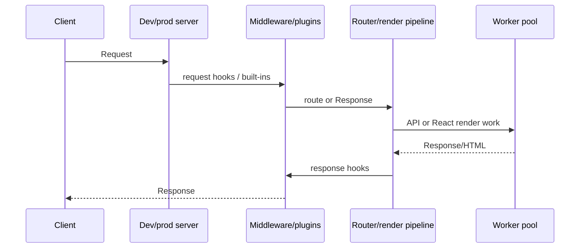

# Architecture

> **Tutorial goal:** trace one request and one build so you can reason about framework boundaries.
> **Start from:** the application workflow in [CLI](10-cli.md). **Checkpoint:** explain which layer
> discovers routes, builds modules, and renders a response.

## Boundary map

```mermaid
flowchart TB
  CLI[ruvyxa_cli] --> GRAPH[ruvyxa_graph]
  CLI --> BUNDLER[ruvyxa_bundler]
  CLI --> SERVER[ruvyxa_dev_server]
  SERVER --> MW[ruvyxa_middleware]
  CLI --> DIAG[ruvyxa_diagnostics]
  BUNDLER --> RT[packages/ruvyxa runtime]
  APP[Application + plugins] --> CLI
  APP --> REACT[@ruvyxa/react]
  APP --> CORE[@ruvyxa/core]
```

`ruvyxa_cli` owns commands, config loading, build output, prerendering, artifact caching, adapter
selection, and package-facing execution. `ruvyxa_graph` discovers and validates file-system routes
and rendering intent. `ruvyxa_bundler` compiles TypeScript/JSX, resolves/links modules, splits
chunks, minifies, writes source maps, handles styles, caches incrementally, and checks server/client
boundaries. `ruvyxa_dev_server` supplies Axum serving, routing, HMR, worker pools, render
cache/pipeline, static assets, i18n, image handling, and plugin bridge/head integration.

`ruvyxa_middleware` owns built-in middleware configuration/stack and plugin host behavior.
`ruvyxa_diagnostics` holds shared diagnostic reporting. JavaScript runtime files in
`packages/ruvyxa/runtime/` execute rendering/compiler/worker/adapters at the boundary where Rust
invokes TypeScript/React work.

## Request lifecycle



Request and response hooks can replace values or continue. Plugin response middleware buffers
TypeScript responses under `security.pluginLimit`, so large streaming responses require careful
sizing and testing. Worker settings are process controls, not a dependency-injection container; no
codebase evidence exposes a general public DI API, queue system, scheduler, or framework-managed
event bus.

## Worker-pool boundary

The pool has three deliberately separate owners:

- `crates/ruvyxa_dev_server/src/worker_pool.rs` owns process creation, least-loaded worker
  selection, request/response correlation, timeouts, replacement, streaming backpressure, and
  process shutdown.
- `packages/ruvyxa/runtime/worker-pool.mjs` owns the NDJSON dispatcher, compilation/render caches,
  request execution, invalidation, and worker health snapshots.
- `packages/ruvyxa/runtime/worker-admission.mjs` owns only bounded FIFO admission state: active
  slots, queued waiters, overload counts, release, and close.

Preserve these invariants when changing the boundary: `ping` and `invalidate` bypass render
admission; every successful acquire has exactly one release; waiting work remains FIFO; overflow
returns `RUV1705`; closing admission settles queued work; and stdout contains NDJSON responses only.
Local modules imported by the worker are both package contents and prerender cache inputs. See the
[worker-pool change matrix](12-development-testing.md#worker-pool-change-matrix) before editing one.

## Build lifecycle

Build validates config and graph, compiles route/client code, runs build plugin hooks, prerenders
eligible SSG/ISR/PPR routes, emits site discovery files, records a manifest, and commits staging
output into place. The artifact cache fingerprints relevant inputs and can reuse final prerendered
HTML when `build.prerenderCache` is enabled (the default). Static adapters require generated
prerendered pages.

**Previous:** [CLI reference](10-cli.md) · **Next:**
[Development and testing](12-development-testing.md)
