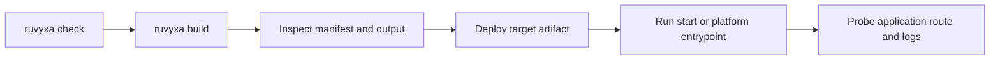

# Deploy, run, and operate in production

## Build and select a target

```bash
pnpm build
# or choose a target/adapter without changing config
ruvyxa build --target static
ruvyxa build --adapter node
```

The verified target values are `node`, `bun`, `edge`, and `static`. Adapter selection accepts Node,
Bun, static, Vercel, Netlify, Cloudflare, Railway, Render, Firebase, AWS, or an adapter package
name. Adapters are build-output contracts; inspect the selected adapter package before assuming
platform configuration, health checks, or scaling semantics.

## Operations sequence



Before deployment, run `ruvyxa check`, `ruvyxa build`, and `ruvyxa test:parity`; then inspect the
manifest/output and exercise a health route that your application implements (the `api-backend`
template includes `app/api/health/route.ts`). The framework does not reserve or implement a
universal health/readiness endpoint.

## Production checklist

- Set `site.url` or private `RUVYXA_SITE_URL` to the real canonical origin before relying on
  generated sitemap URLs. Preview-only Vercel/Netlify URLs are intentionally not selected as
  canonical origins.
- Set an explicit server host/port only when running the Node/Bun process yourself. Let managed
  adapters own their generated entrypoint.
- Persist application state outside process memory. Core cache and auth memory stores are local to
  an instance; provide shared database/cache/session infrastructure where required.
- Configure log collection for structured records and redact at the sink. Wire infrastructure
  metrics/alerts, because the repository does not expose a built-in alert manager, backup service,
  queue worker, or scheduler.
- Use immutable build artifacts and a platform rollback mechanism. The source shows staging output
  that is moved into place only after a build completes, but it does not implement remote release
  orchestration or database rollback.

## Platform limits

Native realtime requires a long-lived Node/Bun build and is rejected for the named serverless/static
adapters. A static adapter needs prerendered pages and cannot render arbitrary SSR at runtime.
Containers, Kubernetes, load balancers, backup/recovery, high availability, and provider-specific
configuration are not defined by this repository; choose and document them in your deployment
environment.

For the exact artifacts and verified handoff command for every first-party adapter, continue with
[Platform adapter guide](20-platform-adapter-guide.md). It separates generated provider files from
provider-owned setup so deployment instructions remain accurate.

**Previous:** [Observability and performance](14-observability-performance.md) · **Next:**
[Troubleshooting and upgrade compatibility](16-troubleshooting-upgrades.md)
