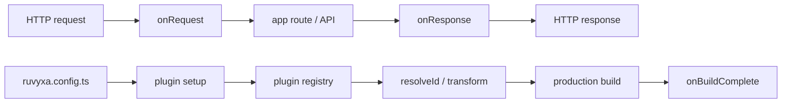

# Plugins

> 🔴 **Advanced** · ⏱️ ~10 min read
>
> **You'll learn:** extend the build and the request pipeline with TypeScript plugins — transforms,
> middleware, and build-complete hooks. Most apps never need a custom plugin.

Ruvyxa plugins are ordinary application modules written in TypeScript.

Create a starter:

```bash
npx ruvyxa plugin new auth
```

The command creates `auth/` (named after the plugin — no `--dir` flag needed) with `src/index.ts`,
`package.json`, `tsconfig.json`, and `README.md`. Add a relative `--dir <path>` only if you want a
different location under the project root; absolute and traversal paths are rejected. The starter
adds a response header so you can see that it is active immediately. Plugins run on both Node.js and
Bun (`--runtime bun` or `RUVYXA_RUNTIME=bun`):

```ts
import { plugin } from 'ruvyxa/config'

export default plugin('auth', {
  routes: ['/*'],
  headers: {
    'x-auth': 'active',
  },
})
```

Import it from `ruvyxa.config.ts`:

```ts
import auth from './auth'
import { config } from 'ruvyxa/config'

export default config({ plugins: [auth] })
```

Use `plugin(name, middleware)` for request/response middleware. It accepts either a middleware
object (with optional `routes`, `onRequest`, `onResponse`) or just a request handler function.
Middleware uses standard Fetch `Request` and `Response`. For the common response-header case, pass
`headers` and Ruvyxa creates the response middleware for you. Start by changing only `routes` and
`headers`; the generated package README repeats those two settings. Use `onRequest` or `onResponse`
only when the behavior needs to inspect or change a request/response dynamically.

## Start with these examples

### 1. Add one header (the CLI starter)

```ts
import { plugin } from 'ruvyxa/config'

export default plugin('api-cache', {
  routes: ['/api/*'],
  headers: {
    'cache-control': 'no-store',
  },
})
```

This runs only for `/api/*` and adds `cache-control: no-store` to matching responses. No hook or
response-copying code is needed.

### 2. Allow or block a request

```ts
import { plugin } from 'ruvyxa/config'

export default plugin('require-api-key', {
  routes: ['/api/*'],
  onRequest(request) {
    if (request.headers.has('x-api-key')) return
    return new Response('Missing API key', { status: 401 })
  },
})
```

| Return value       | What happens                                         |
| ------------------ | ---------------------------------------------------- |
| Nothing (`return`) | The request continues to the app.                    |
| A `Request`        | Ruvyxa continues with the replacement request.       |
| A `Response`       | Ruvyxa sends it immediately and skips the app route. |

Use `onResponse` only when the response value must depend on the request or the response itself. For
example, `withResponseHeader(response, name, value)` creates a safe response copy with one changed
header.

For `resolveId`, `transform`, or `onBuildComplete`, use the advanced `definePlugin({ name, setup })`
form. All hooks run in the persistent Node/Bun runtime; there is no separate compiler, debug
command, or custom middleware ABI.

## Detailed plugin authoring guide

### 1. Where a plugin runs

A plugin is **Node/Bun** code that Ruvyxa calls during a request or build. It is not a React
component and does not run directly in the browser. Put a 2.5D scene, Canvas, or browser control in
the application's `app/` tree; use a plugin for route policy, request/response changes, build-time
source changes, and post-build files.



Order in `plugins: [...]` matters: Ruvyxa calls `setup` and registered hooks in that order. Plugin
names must be unique within one config.

### 2. Create a starter package

Create one in the project root:

```bash
npx ruvyxa plugin new request-policy
```

Or choose a location inside the project root:

```bash
npx ruvyxa plugin new request-policy --dir packages/request-policy
```

The CLI creates a publishable package:

```text
request-policy/
├── package.json       package name, peer dependency, and build script
├── tsconfig.json      emits JavaScript and declarations into dist/
├── README.md          starter, build, use, and publishing instructions
└── src/
    └── index.ts       default plugin export
```

The CLI name becomes both the directory and the suffix of the package name. For example,
`request-policy` becomes `ruvyxa-plugin-request-policy`. Use lowercase hyphenated names so npm
publishing and imports remain predictable.

### 3. Build and register it locally

Build the local package once before importing it:

```bash
cd request-policy
npm install
npm run build
```

Then add it to the application's `ruvyxa.config.ts`:

```ts
import { config } from 'ruvyxa/config'
import requestPolicy from './request-policy'

export default config({
  plugins: [requestPolicy],
})
```

After publishing, install the package from npm and change the import to:

```ts
import requestPolicy from 'ruvyxa-plugin-request-policy'
```

Do not use a plugin module-level cache, counter, or session as a source of truth that must be shared
between requests: config, middleware, and render/action workers can be separate processes.

### 4. Choose the right API

| Goal                                 | API                        | Example                      |
| ------------------------------------ | -------------------------- | ---------------------------- |
| Add static headers                   | `plugin(..., { headers })` | cache policy, build label    |
| Allow, block, or replace a request   | `onRequest`                | API key, locale header       |
| Produce a dynamic response change    | `onResponse`               | request ID, route metadata   |
| Change an import before resolving it | `resolveId`                | alias or virtual specifier   |
| Change source before compiling       | `transform`                | compile-time marker          |
| Write an artifact after building     | `onBuildComplete`          | JSON metadata, feed, sitemap |

Start with `plugin(name, options)` whenever the work is only middleware. Use `definePlugin` once at
least one build hook is required.

### 5. Scope a plugin with `routes`

`routes` is both a correctness and performance filter: requests that do not match skip the plugin
runtime round-trip altogether.

| Value             | Matches                      | Use when                                    |
| ----------------- | ---------------------------- | ------------------------------------------- |
| Omit `routes`     | every route                  | the plugin truly belongs on every request   |
| `['*']`           | every route                  | you want to declare global scope explicitly |
| `['/api/health']` | that exact path              | one endpoint                                |
| `['/api/*']`      | every path beginning `/api/` | an API group                                |

Only `*`, paths beginning with `/`, and prefixes ending in `*` are valid. `/api/*` is valid;
`api/*`, `/api/*/items`, and `/*.json` are rejected at plugin startup rather than silently missing.

### 6. The simplest case: add response headers

```ts
import { plugin } from 'ruvyxa/config'

export default plugin('request-policy', {
  routes: ['/api/*'],
  headers: {
    'cache-control': 'no-store',
    'x-request-policy': 'enabled',
  },
})
```

`headers` is response-middleware shorthand. Ruvyxa copies the original response, preserves its
status and body, and adds or replaces the headers. Use it for values that do not need to inspect a
request or response.

### 7. Change or stop a request with `onRequest`

`onRequest(request, context)` receives a Fetch `Request` and `{ plugin, root }`:

```ts
import { plugin } from 'ruvyxa/config'

export default plugin('require-api-key', {
  routes: ['/api/*'],
  onRequest(request, { plugin }) {
    if (request.headers.has('x-api-key')) return
    return new Response(`${plugin}: Missing API key`, { status: 401 })
  },
})
```

Return values mean:

| Return                   | Result                                              |
| ------------------------ | --------------------------------------------------- |
| `undefined` or no return | the original request continues to the app           |
| `Request`                | the replacement request continues to the next step  |
| `Response`               | Ruvyxa sends it immediately and skips the app route |

To add metadata without changing the body:

```ts
onRequest(request) {
  const headers = new Headers(request.headers)
  headers.set('x-request-source', 'request-policy')
  return new Request(request, { headers })
}
```

Do not treat a client-supplied header as sufficient authorization evidence, and never return secrets
in a response.

### 8. Change a response dynamically with `onResponse`

Use `onResponse` when the value depends on the request or existing response. This example exposes
the path the plugin actually matched:

```ts
import { plugin, withResponseHeader } from 'ruvyxa/config'

export default plugin('route-label', {
  routes: ['/showcase/*'],
  onResponse(request, response) {
    return withResponseHeader(response, 'x-ruvyxa-route', new URL(request.url).pathname)
  },
})
```

`onResponse(request, response, context)` receives cloned objects and may return a `Response` or
`undefined`. When it returns `undefined`, the previous response remains in place. Use
`withResponseHeader` when changing a single header so you do not need to repeat response-copying
boilerplate.

### 9. Use `definePlugin` for build hooks

When a plugin needs the module graph or build output, use `definePlugin` and register hooks in
`setup`:

```ts
import path from 'node:path'
import { definePlugin } from 'ruvyxa/config'

export default definePlugin({
  name: 'build-label',
  setup({ resolveId, transform, onBuildComplete }) {
    resolveId((id, _importer, { root }) => {
      if (id !== '~build-label') return
      return path.join(root, 'plugins', 'build-label.ts')
    })

    transform((code, id, { environment }) => {
      if (environment !== 'client' || !id.endsWith('/app/build-label.ts')) return
      return code.replace('BUILD_LABEL', 'built-by-plugin')
    })

    onBuildComplete(({ outDir, manifest }) => {
      console.info(`Build written to ${outDir}; manifest entries: ${Object.keys(manifest).length}`)
    })
  },
})
```

| Hook              | Receives                                | Allowed return                                  | Remember                                                        |
| ----------------- | --------------------------------------- | ----------------------------------------------- | --------------------------------------------------------------- |
| `resolveId`       | `(id, importer, { root, environment })` | path, `null`, or `undefined`                    | the first non-`null`/`undefined` value wins                     |
| `transform`       | `(code, id, { root, environment })`     | string, `{ code, map }`, `null`, or `undefined` | following hooks see the changed source                          |
| `onBuildComplete` | `({ root, outDir, manifest })`          | `void` or a Promise                             | core output is committed, but adapters are not materialized yet |

The current plugin runtime sends `client` or `server` as `environment`. Check both environment and
file path before changing source so a transform cannot affect unrelated modules.

For a public artifact that must travel with an adapter, write it beneath `outDir/assets` in
`onBuildComplete`. Do not overwrite files owned by another plugin or write outside the intended
project/output directory.

### 10. Test and diagnose a plugin

Check the package first:

```bash
cd request-policy
npm run build
```

Then check it with the application:

```bash
npx ruvyxa dev
npx ruvyxa check
```

For a header plugin, call a route covered by `routes` and inspect response headers in Browser
DevTools

> Network, or use:

```bash
curl -i http://localhost:3000/api/health
```

When a plugin appears inactive, check in this order:

1. Is it imported and present in `plugins: [...]`?
2. Is its name unique?
3. Does the request path actually match `routes`?
4. Does the local package have current `dist/` output?
5. Does the hook return a supported value (`Request`, `Response`, or `undefined`)?
6. Does the terminal show a plugin runtime error?

### 11. Runtime, deployment, and performance

- Middleware runs in a persistent Node/Bun process and starts with one worker by default.
- Set `middleware.workers` to 1–8 only for stateless middleware; module-level state is not shared
  between workers.
- Each middleware hook has `timeoutMs` (30,000 ms by default; 1–300,000 ms). Avoid slow I/O and
  request-path side effects that would not be safe to retry.
- A crashed worker restarts and retries the in-flight hook once. A timed-out hook or malformed
  protocol response replaces the worker without retrying because a side effect may already exist.
- A fully static host has no middleware runtime. Configure equivalent header, security, and cache
  policy in that host or its adapter.

### 12. Publish safely

The starter includes `prepublishOnly: npm run build`. Before publishing, test it in a real app and
confirm that `package.json` points `main`, `types`, and `exports` at `dist/`. Then bump the version
and run:

```bash
npm publish
```

Ruvyxa is a starter `peerDependency`: users of the plugin already provide the framework. Do not
bundle another copy of the framework into the plugin package.

## Built-in plugins

Ruvyxa also publishes three installable official packages for application state:

- `@ruvyxa/database` — typed CRUD/transaction facade. `prismaAdapter()` covers PostgreSQL, MySQL,
  SQLite, and MongoDB; `dynamoAdapter()` uses an explicit AWS transport.
- `@ruvyxa/auth` — credentials, OAuth PKCE (Google/GitHub helpers), magic links, delegated WebAuthn,
  secure sessions, atomic token stores, and rate limiting.
- `@ruvyxa/realtime` — native action-driven WebSocket updates for self-hosted Node/Bun.

```ts
// ruvyxa.config.ts
import { databasePlugin } from '@ruvyxa/database'
import { realtime } from '@ruvyxa/realtime'
import { config } from 'ruvyxa/config'

export default config({
  plugins: [databasePlugin({ requiredEnv: ['DATABASE_URL'] }), realtime()],
})
```

Create database and auth runtimes in server-only application modules; do not use process-global
state from config as a shared store. Browser auth code imports `@ruvyxa/auth/client`, and browser
realtime code imports `@ruvyxa/realtime/client`. Root `@ruvyxa/auth` and `@ruvyxa/database` imports
are rejected in client graphs with `RUV1007`.

Native realtime supports `ruvyxa dev` and long-lived Node/Bun processes, including Railway and
Render. Static, Vercel, Netlify, Cloudflare, Firebase, AWS Amplify, and Edge builds fail with
`RUV3201` because those adapters do not own a persistent portable WebSocket process. Auth uses
`auth.plugin` on the self-hosted middleware path or `auth.handle(request)` in a serverless API
route. See [Official Data, Auth, and Realtime Packages](../../architecture/official-plugins.md) for
complete flows, endpoints, security invariants, and the compatibility matrix.

`ruvyxa/plugins` continues to ship zero-install first-party plugins built on the same public hooks:

`ruvyxa/plugins` ships first-party plugins built on the same public hooks:

```ts
import { config } from 'ruvyxa/config'
import {
  cacheRules,
  contentEngine,
  feed,
  observability,
  openApi,
  pwa,
  robots,
  searchIndex,
  securityHeaders,
} from 'ruvyxa/plugins'

export default config({
  plugins: [
    observability({ routes: ['/api/*'] }),
    securityHeaders({
      contentSecurityPolicy: {
        'default-src': ["'self'"],
        'object-src': ["'none'"],
      },
    }),
    cacheRules([
      { source: '/api/*', browser: 'no-store' },
      { source: '/blog/*', browser: 'public, max-age=60', cdn: 'max-age=300' },
    ]),
    pwa({ name: 'Example', offlineFallback: '/offline' }),
    robots({
      sitemap: 'https://example.com/sitemap.xml',
      openAi: { search: true, training: false },
    }),
    contentEngine({
      siteUrl: 'https://example.com',
      title: 'Example',
      description: 'Latest articles',
      locale: 'en',
    }),
    openApi({
      info: { title: 'Example API', version: '1.0.0' },
      operations: [{ method: 'get', path: '/api/health', summary: 'Health check' }],
    }),
  ],
})
```

- `redirects(rules)` — declarative redirects served before rendering. Exact paths or trailing-`*`
  prefixes; a `*`-suffixed destination receives the matched remainder. `permanent: true` responds
  308 instead of 307.
- `headers(rules)` — response headers per route. Rules without `source` apply everywhere.
- `observability({ routes, requestIdHeader, traceContext, serverTiming, log, logger })` — propagates
  a validated request ID and W3C `traceparent`, measures across middleware workers, appends a
  `Server-Timing` metric, and logs method/path/status without query strings. Set `log: false` or
  provide `logger(entry)` when the application already has a log pipeline. A failing custom log sink
  is reported but never fails the application response.
- `securityHeaders(options)` — adds HSTS by default and optional CSP, permissions, referrer,
  cross-origin, frame, and custom headers. Ruvyxa's native defaults fill only missing headers, so
  explicit plugin policies win. CSP is opt-in because one universal policy would break valid apps.
- `cacheRules(rules)` — sets browser `Cache-Control`, shared `CDN-Cache-Control`, and merged `Vary`
  values per route. Later matching rules override earlier cache policies.
- `sitemap({ siteUrl, exclude, robots })` — writes `sitemap.xml` (and optionally `robots.txt`) into
  the served asset directory after each production build, from the route manifest. Dynamic patterns
  and API routes are skipped.
- `robots({ rules, sitemap, openAi })` — standalone `robots.txt` generation. The `openAi` preset
  controls OAI-SearchBot (`search`) independently from GPTBot (`training`); explicit duplicate agent
  rules are rejected instead of producing an ambiguous policy.
- `pwa(options)` — generates and serves a web manifest, service worker, and registration module;
  injects their tags into matching HTML responses; and patches matching prerendered HTML. Provide
  `precache` and `offlineFallback` explicitly so the service worker never guesses application data.
  Cache namespaces are isolated by service-worker scope, including when several apps share an
  origin.
- `contentEngine({ siteUrl, title, description, ... })` — scans native `app/**/page.md(x)` routes
  once and derives `/content.json`, `/search-index.json`, `/rss.xml`, `/sitemap.xml`, and an
  experimental `/llms.txt` link/answer index from their frontmatter and body. Artifacts stay live
  during development and are written byte-equivalently for production. Route groups are removed,
  drafts and private folders are excluded, and dynamic routes are skipped until they have a
  canonical static path. Supported metadata includes `title`, `description`/`summary`, `tags`,
  `publishedAt`/`date`, `updatedAt`, `author`, `answers`, and `draft`; answer citations are
  normalized to public HTTP(S) URLs, and custom JSON-compatible frontmatter remains available in the
  content manifest. Use `llmsPath: false` to disable the experimental file or set a different public
  path.
- `feed({ siteUrl, title, description, items, path })` — generates RSS 2.0 from an item array or an
  async build-time loader. The default output is `/rss.xml`.
- `searchIndex({ documents, locale, stopWords, minTermLength, path })` — generates a deterministic
  JSON inverted index. `Intl.Segmenter` provides word boundaries for languages including Thai; the
  default output is `/search-index.json`.
- `openApi({ info, operations, servers, tags, components, path })` — validates operation uniqueness,
  serves OpenAPI 3.1 JSON during development, and writes `/openapi.json` for production.
- `alias(map)` — resolves exact import specifiers to project files before the native resolver.
- `bundleBudget({ maxChunkKb, maxTotalKb })` — fails the production build when emitted client
  JavaScript exceeds the budget, so bundle regressions surface in CI.
- `requireEnv(names)` — fails the production build when required environment variables are missing
  or empty.

Use `contentEngine()` instead of the standalone `feed()`, `searchIndex()`, and `sitemap()` plugins
when they describe the same Markdown/MDX collection. If an application needs both, configure
distinct output paths so two plugins never write the same artifact.

`answers` must contain author-written `question` and `answer` strings, with optional
`sources: [{ name, url }]`. Render that same data visibly with `Answer` from `@ruvyxa/react`;
Content Engine deliberately does not infer answers or generate FAQ/QAPage markup. `llms.txt` is an
experimental discovery aid and does not replace indexable HTML, accurate structured data, canonical
URLs, or sitemap freshness.

Build-generated public files run before adapter materialization. Therefore Content Engine, sitemap,
PWA, feed, search, and OpenAPI files are included in static and hybrid deployment artifacts rather
than only the local `.ruvyxa` directory. Static adapters preserve the same URLs as the production
server: public files stay at `/...` and client bundles stay under `/__ruvyxa/client/...`. Generated
files use atomic replacement, and configurable artifact paths reject cross-origin, traversal,
directory, and colliding PWA endpoint values during configuration.

`observability`, `securityHeaders`, and `cacheRules` are runtime response plugins. On a serverless
or long-running adapter they run normally; a fully static host has no middleware runtime, so set
equivalent security/cache headers in that host or adapter configuration.

Middleware `routes` are also reported to the native server, which skips the plugin round-trip
entirely for requests no middleware can match — keep middleware route-scoped where possible. Route
patterns must be `*`, an exact path beginning with `/`, or a prefix ending in `*`; invalid patterns
fail during plugin startup instead of silently never matching.

## Middleware worker pool

Plugin middleware runs on one persistent runtime process by default. When stateless middleware on
hot routes becomes a throughput bottleneck, `middleware.workers` (1–8) starts a pool of identical
runtime processes dispatched round-robin:

```ts
export default config({
  middleware: {
    workers: 2,
    timeoutMs: 15_000,
  },
})
```

Workers do not share module-level plugin state — counters, caches, or sessions kept in plugin module
scope become per-process. Keep the default of one worker unless plugin middleware is stateless. The
pool prefers an idle worker before queueing behind a busy one. `timeoutMs` bounds each middleware
hook (default 30,000; range 1–300,000 ms). A crashed worker is restarted and the in-flight hook is
retried once. Timed-out hooks and malformed protocol responses replace the worker without retrying,
because the hook may already have produced side effects.
