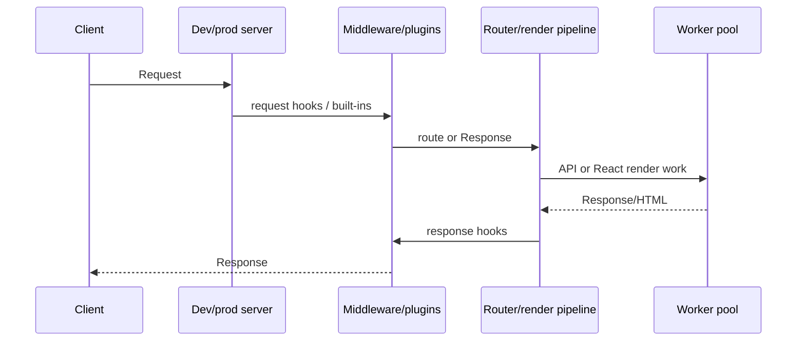

# Architecture

> **เป้าหมายของ tutorial:** ตามรอย request และ build อย่างละหนึ่งครั้ง เพื่อให้เหตุผลกับขอบเขตของ
> framework ได้ **เริ่มจาก:** application workflow ใน [CLI](10-cli.md) **Checkpoint:** อธิบายได้ว่า
> layer ใดค้นหา route, build module และ render response

## Boundary map

```mermaid
flowchart TB
  CLI[ruvyxa_cli] --> GRAPH[ruvyxa_graph]
  CLI --> BUNDLER[ruvyxa_bundler]
  CLI --> SERVER[ruvyxa_dev_server]
  SERVER --> MW[ruvyxa_middleware]
  CLI --> DIAG[ruvyxa_diagnostics]
  BUNDLER --> RT[packages/ruvyxa runtime]
  APP[Application + plugins] --> CLI
  APP --> REACT[@ruvyxa/react]
  APP --> CORE[@ruvyxa/core]
```

`ruvyxa_cli` เป็นเจ้าของ command, config loading, build output, prerendering, artifact caching,
adapter selection และ execution ฝั่ง package `ruvyxa_graph` ค้นหาและ validate file-system route และ
rendering intent `ruvyxa_bundler` compile TypeScript/JSX, resolve/link module, split chunk, minify,
เขียน source map, จัดการ style, cache แบบ incremental และตรวจ server/client boundary
`ruvyxa_dev_server` ให้ Axum serving, routing, HMR, worker pool, render cache/pipeline, static
asset, i18n, image handling และ plugin bridge/head integration

`ruvyxa_middleware` เป็นเจ้าของ built-in middleware configuration/stack และ plugin host
`ruvyxa_diagnostics` เก็บ diagnostic reporting ที่ใช้ร่วมกัน JavaScript runtime ใน
`packages/ruvyxa/runtime/` ทำ rendering/compiler/worker/adapter ณ boundary ที่ Rust เรียก
TypeScript/React

## Request lifecycle



request และ response hook แทนค่าหรือ continue ได้ plugin response middleware buffer TypeScript
response ภายใต้ `security.pluginLimit` จึงต้องกำหนดขนาดและทดสอบ response streaming ขนาดใหญ่ให้รอบคอบ
worker setting เป็น process control ไม่ใช่ dependency-injection container; ไม่พบหลักฐานของ public DI
API ทั่วไป, queue system, scheduler หรือ framework-managed event bus

## ขอบเขตของ worker pool

pool แยกเจ้าของความรับผิดชอบไว้สามส่วนอย่างตั้งใจ:

- `crates/ruvyxa_dev_server/src/worker_pool.rs` เป็นเจ้าของการสร้าง process, การเลือก worker
  ที่มีงานค้างน้อยที่สุด, การจับคู่ request/response, timeout, replacement, streaming backpressure
  และการปิด process
- `packages/ruvyxa/runtime/worker-pool.mjs` เป็นเจ้าของ NDJSON dispatcher, compilation/render cache,
  การรัน request, invalidation และ worker health snapshot
- `packages/ruvyxa/runtime/worker-admission.mjs` เป็นเจ้าของเฉพาะ bounded FIFO admission state:
  active slot, queued waiter, overload count, release และ close

เมื่อแก้ boundary นี้ต้องรักษา invariant ต่อไปนี้: `ping` และ `invalidate` ไม่เข้าคิว render; ทุก
acquire ที่สำเร็จต้องมี release เพียงหนึ่งครั้ง; งานที่รอต้องเป็น FIFO; queue overflow คืน
`RUV1705`; การปิด admission ต้อง settle งานในคิว; และ stdout มีเฉพาะ NDJSON response เท่านั้น local
module ที่ worker import เป็นทั้งเนื้อหาใน package และ input ของ prerender cache ดู
[ตารางการเปลี่ยน worker pool](12-development-testing.md#worker-pool-change-matrix)
ก่อนแก้ไฟล์เหล่านี้

## Build lifecycle

build validate config และ graph, compile route/client code, รัน build plugin hook, prerender
SSG/ISR/PPR route ที่เข้าเกณฑ์, สร้าง site discovery file, บันทึก manifest และ commit staging output
เข้าที่ artifact cache fingerprint input ที่เกี่ยวข้องและ reuse final prerendered HTML ได้เมื่อเปิด
`build.prerenderCache` (ค่าเริ่มต้น) static adapter ต้องการ prerendered page ที่สร้างแล้ว

**ก่อนหน้า:** [CLI reference](10-cli.md) · **ถัดไป:**
[Development และ testing](12-development-testing.md)
