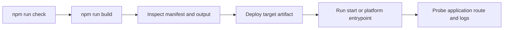

# Deploy, run และ operate ใน production

## Build และเลือก target

```bash
npm run build
# หรือเลือก target/adapter โดยไม่แก้ config
npm run build -- --target static
npm run build -- --adapter node
```

target ที่ยืนยันแล้วคือ `node`, `bun`, `edge` และ `static` adapter selection รับ Node, Bun, static,
Vercel, Netlify, Cloudflare, Railway, Render, Firebase, AWS หรือชื่อ adapter package adapter เป็น
build-output contract; ตรวจ package ของ adapter ที่เลือกก่อนสมมติ platform configuration, health
check หรือ scaling semantics

## ลำดับ operations



ก่อน deploy ให้รัน `npm run check`, `npm run build` และ `npm run test:parity`; แล้วตรวจ
manifest/output และเรียก health route ที่ application ของคุณทำเอง (`api-backend` template มี
`app/api/health/route.ts`) framework ไม่ได้สำรองหรือ implement health/readiness endpoint แบบสากล

## Production checklist

- ตั้ง `site.url` หรือ `RUVYXA_SITE_URL` แบบ private เป็น canonical origin จริงก่อนพึ่ง generated
  sitemap URL preview-only Vercel/Netlify URL จะไม่ถูกเลือกเป็น canonical origin โดยตั้งใจ
- ตั้ง server host/port ชัดเจนเมื่อคุณรัน Node/Bun process เองเท่านั้น ให้ managed adapter
  เป็นเจ้าของ generated entrypoint
- เก็บ application state นอก process memory core cache และ auth memory store เป็น local ต่อ
  instance; ให้ shared database/cache/session infrastructure เมื่อจำเป็น
- ตั้ง log collection สำหรับ structured record และ redact ที่ sink เชื่อม infrastructure
  metric/alert เพราะ repository ไม่มี built-in alert manager, backup service, queue worker หรือ
  scheduler
- ใช้ immutable build artifact และ platform rollback mechanism source แสดง staging output
  ที่ย้ายเข้าที่หลัง build สำเร็จ แต่ไม่ implement remote release orchestration หรือ database
  rollback

## Platform limit

native realtime ต้องเป็น long-lived Node/Bun build และถูกปฏิเสธสำหรับ serverless/static adapter
ที่ระบุ static adapter ต้องมี prerendered page และ render SSR โดยพลการตอน runtime ไม่ได้ container,
Kubernetes, load balancer, backup/recovery, high availability และ provider-specific configuration
ไม่ได้กำหนดโดย repository นี้; เลือกและบันทึกไว้ใน deployment environment ของคุณ

สำหรับ artifact ที่แน่นอนและ handoff command ที่ยืนยันแล้วของ first-party adapter ทุกตัว ให้ไปต่อที่
[คู่มือ platform adapter](20-platform-adapter-guide.md) หน้านี้แยก generated provider file ออกจาก
provider-owned setup เพื่อให้คำสั่ง deploy ถูกต้องตาม implementation

**ก่อนหน้า:** [Observability และ performance](14-observability-performance.md) · **ถัดไป:**
[Troubleshooting และ compatibility เมื่ออัปเกรด](16-troubleshooting-upgrades.md)
